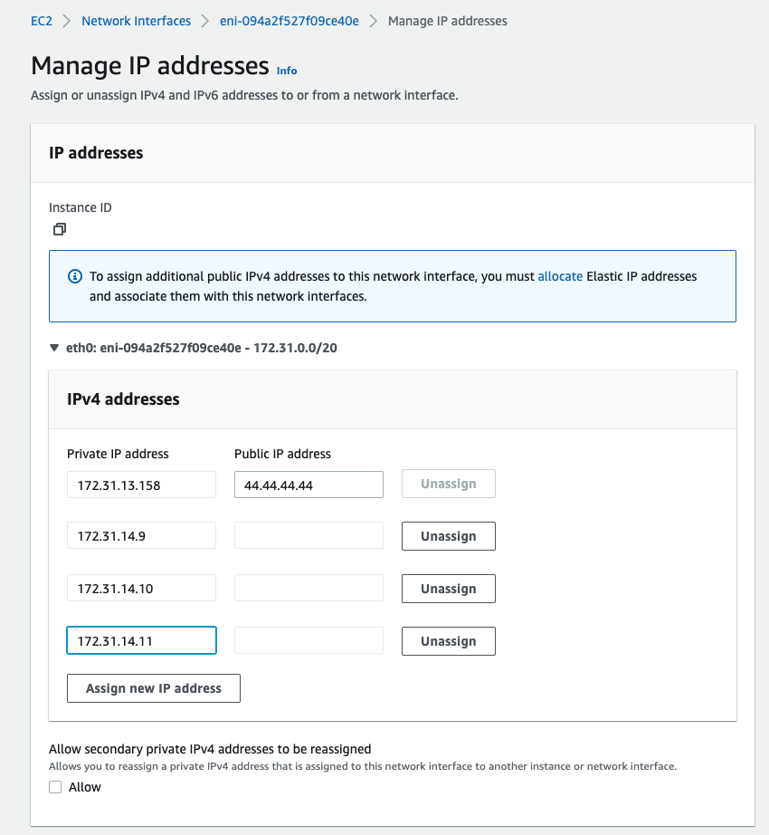

# Installing Proxmox VE 7 on AWS EC2

Getting Proxmox to run on EC2 is a little tricky, but by using my cloud-init config you can automate the install process
and get an instance running in minutes.

## Note for hosting VM guests

Please note that if you want to be able to host VM guests in EC2 (rather than containers), Proxmox needs to run on an
"metal" instance type (I only tested Intel, AMD might work too) to have access to VT-x/AMD-V and hence KVM hardware 
acceleration (e.g. `c5n.metal`, `m5zn.metal`). 

These instances are **very expensive** (starting at around $4/hour), because rather than getting a small slice of a 
machine to run your VM on, you're getting an entire EC2 server, with hundreds of gigs of RAM and many cores. 
Significant cost reductions (75%) are possible if you are able to take advantage of Spot Instances.

See the list of available metal instance types here, and be sure to filter by Physical Processor type to exclude 
Graviton:

https://instances.vantage.sh/?filter=metal

It's possible to run VMs without KVM support by turning it off on the "Options" tab of the VM, but this is 
*excruciatingly* slow and only useful for experimentation.

## Launching your Proxmox VM

Launch a new VM with the following settings:

- AMI: Use an official Debian 11 AMD64 AMI, e.g. from this list: https://wiki.debian.org/Cloud/AmazonEC2Image/Bullseye
  
  You can fetch the latest Debian 11 AMI ID programmatically with the AWS CLI like so:
  ```bash
  aws ssm get-parameter --name /aws/service/debian/daily/bullseye/latest/amd64
  ```
- Instance type: Something with at least 2GiB of RAM, e.g. `t3.small` for hosting containers, or a `metal` instance type
  for hosting VMs. 
 
  `t3.micro` (with 1GiB of RAM) rapidly runs out of memory and freezes, even with no workloads running.
- Network settings: To get started you can set up a security group which allows access to all TCP ports to your IP 
  address only.

  **Avoid exposing Proxmox to the Web at large!** If you need access from multiple IP addresses then set up a VPN to 
  protect access to Proxmox.
- Storage: You can set up the initial size of your root disk here. I set mine to 64GB since I'm planning to store some
  ISOs and containers on the root disk.
- Advanced details: In this section, scroll all the way down to **User Data**. Paste in 
  [this user-data script](https://raw.githubusercontent.com/thenickdude/proxmox-on-ec2/master/cloud-init.yaml). 
 
  At the start of that script you can edit the `hostname` and `fqdn` fields to set the hostname of your server.
  e.g. you might set `hostname` to `pve` and `fqdn` to `pve.example.com`. The hostname becomes the name of your Proxmox
  node and is not easily changed later.

Now launch the instance. In the background, the user-data script will automatically download and install Proxmox and 
configure the network for you.

You can check the installation progress in the EC2 console by clicking Actions > Monitor and Troubleshoot > 
EC2 Serial Console, this is equivalent to Proxmox's console monitor. Or you can SSH in and run `tail -f /var/log/syslog` 
instead. 

Note that the serial console is not supported on `metal` instance types.

You need to SSH in to set a password for the `root` account so that you'll be able to use this
password to log in to Proxmox's Web console, you can do this while the installation is still running.

Run `ssh root@YOUR_PUBLIC_IP` (using your private key), then run `passwd` to set the password for
root.

Once setup completes (the last line'll be `[  OK  ] Reached target Cloud-init target.`, which I reached in about 7 
minutes on `t3.small`), you can access Proxmox's console by visiting `https://<your instance's public IP>:8006/`,
and log in using `root` as your username and the password you set. 

**You need to reboot Proxmox now** to complete the installation of system updates and switch to the Proxmox kernel (containers 
will fail to launch otherwise, with fatal AppArmor errors!)

## Note on host network config

The system supports ENIs (network adapters) being attached dynamically at runtime, so the config for these is 
automatically generated using `/etc/network/cloud-interfaces-template` and stored into `/run/network/interfaces.d`. 
DHCP is used for these interfaces to pick up the correct private IPv4 addresses from EC2.

Because Proxmox doesn't know about these config files, using Proxmox to edit the network config causes it to generate
non-functional stub configs for those network adapters, which breaks networking.

**So always edit `/etc/network/interfaces` by hand** instead of using Proxmox's "System > Network" panel in the WebUI.

If you end up locking yourself out due to bad network config, you can log in using the Serial Console to fix up
`/etc/network/interfaces`, and then run `systemctl restart networking.service` afterwards to apply your changes.

**No IPv6 support is enabled.** This is possible, but as I don't have a usecase for it myself I haven't tested it 
out.

## Guest networking

### NAT guests

On EC2 your Proxmox server only has one IP address by default, so VMs/containers will need to use NAT to share the host's
IP address to talk to the rest of the network. 

My install script automatically sets up `vmbr0` for you at `10.10.10.1/24`, using NAT, with a `dnsmasq` DHCP server 
available on that interface. 

So if you add guests to `vmbr0`, and enable DHCP in your guest's network settings, they should get an IP address 
automatically and be able to connect to the Internet.

These guests don't have an IP address which is visible to the EC2 network, they can only be connected to from Proxmox
and from other guests. If you need this support, read on to the next section!

### Routed guests

If you want to assign a proper IP address to your guests, you can add multiple local IP addresses to your instance's
ENI. Check this article to see what the limit is for your instance type:

https://docs.aws.amazon.com/AWSEC2/latest/UserGuide/using-eni.html

e.g. for `t3.small`, this limit is 4 local IP addresses (1 for Proxmox and 3 for guests).

My instance's subnet's CIDR is `172.31.0.0/20`, so I decide on a subnet somewhere within that range to allocate my 
guest IP addresses in, `172.31.14.8/29`. Of that subnet, the first address will be used by Proxmox's bridge 
(`172.31.14.8`), so I add the subsequent addresses `172.31.14.9`, `172.31.14.10`, and `172.31.14.11` to my ENI's IP 
private address pool:



I edit Proxmox's `/etc/network/interfaces` to add a definition for a new bridge, `vmbr1`, with its address set to the 
first IP address of that subnet:

```
auto vmbr1
iface vmbr1 inet static
# Routed network for guests with manually-allocated secondary private ENI IPs
    address 172.31.14.8/29
    bridge-ports none
    bridge-stp off
    bridge-fd 0

    post-up echo 1 > /proc/sys/net/ipv4/ip_forward
    post-up echo 1 > /proc/sys/net/ipv4/conf/MAIN_NETWORK_ADAPTER_NAME_HERE/proxy_arp
```

Load the new configuration by running `systemctl restart networking.service`.

Then when launching guests, attach them to `vmbr1`, set their IP address manually from
`vmbr1`'s subnet, e.g. `172.31.14.9/29` (`/29` is equivalent to a subnet mask of `255.255.255.248`), and set their 
gateway to the IP address for `vmbr1`, e.g. `172.31.14.8`. You can set their DNS server to `169.254.169.253`,
which is the AWS VPC DNS server address, or otherwise just point it at your favourite public DNS service, like `8.8.8.8`.

**The security group for the ENI applies to both the host and to all guests**, so if you want to restrict 
access to specific guests you'll need to use Proxmox's firewall rules to achieve that.

Now your guests can access and be accessed by hosts on the local VPC network. But right now they don't have a 
public IP assigned, so they can't connect to the Internet or be connected to from it.

**To give a guest a public IP,** you need to allocate an Elastic IP address, associate it with the ENI, and bind it to the
corresponding Private IP address. 

Note that if you do this, Proxmox itself will no longer be allocated a temporary public IP address automatically on 
instance startup, so you need to attach an Elastic IP address to that too if you need to retain public-IP access to it.

## Turning Proxmox into an AMI

You can create an AMI from Proxmox and use that to launch a new EC2 instance, although note that the caveats described
here still apply if you want to change the hostname (can't have any containers or VMs created beforehand):

https://pve.proxmox.com/wiki/Renaming_a_PVE_node

When you launch a new instance from the AMI, in the launch wizard use this User Data script to set the hostname (in 
place of the IP-address based hostname it would otherwise generate automatically):

```yaml
#cloud-config
hostname: proxmox
fqdn: proxmox.local
```
